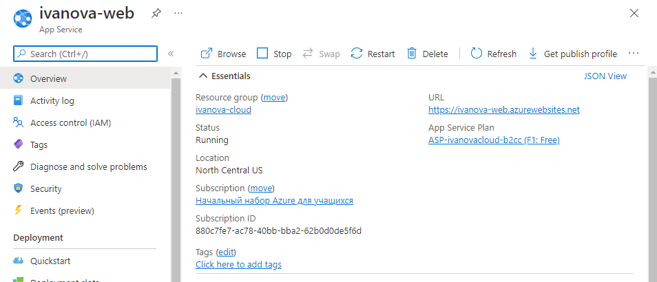
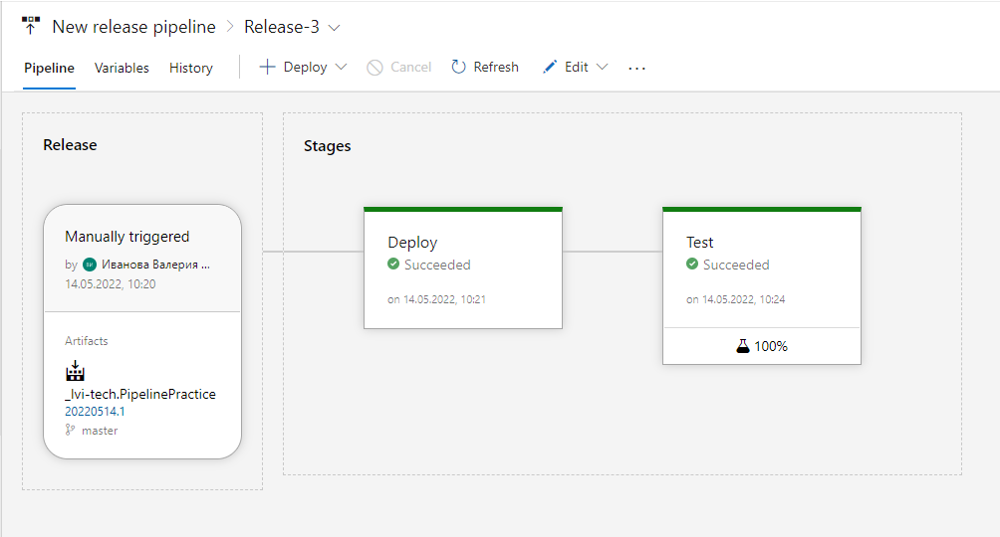
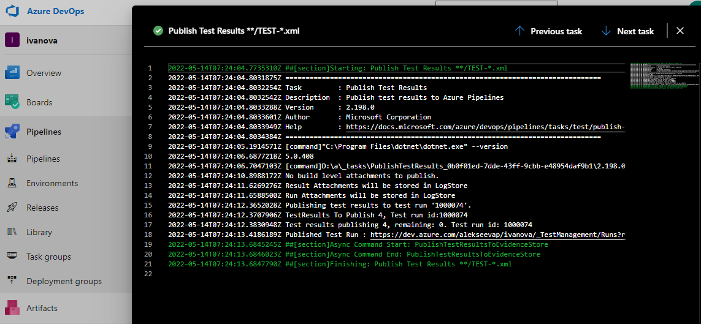
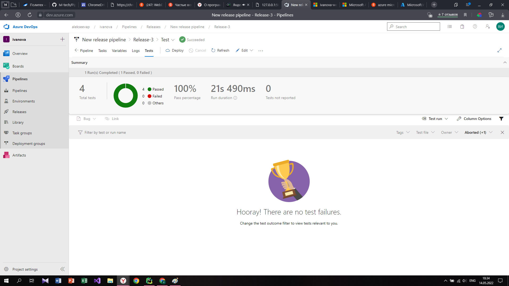

# Pipeline Practice

# Задание
1. Локально запустить юнит и функциональные тесты
2. В репозитории организовать конвейер CI с запуском Юнит тестов, упаковкой приложения в архив. В readme указать лейбл с успешным прохождением пайплайна (по-желанию).
3. Организовать CD конвейр с разворачиванием приложения в Azure Web App, протестировать приложение фуникцональными тестами (автоматически при развертке)

#Отчёт

Azure Pipelines автоматически создает и тестирует проекты кода, чтобы сделать их доступными для других пользователей. 
В данной работе был создан веб-интерфейс для  работы с программой, имметирующий простой калькулятор. 

Созданое приложение в Azure DevOps:

При переходе на ссылку нашего приложения получаем:

Ссылка на данное приложение:
https://ivanova-web.azurewebsites.net

Настроенный пайплайн в Azure DevOps:

Прохождения тестов:

Результаты прохождения функциональных тестов:

Работа с приложением осуществляется посредством ввода дополнительных данных в поисковую строку.
Калькулятор реализует следующие операции:
- сложение /add
- умножение /multiply
- вычитание /substract
- деление /divide

Для реализации запроса необходимо в строке добавить следующее:

<операция>/<значение 1>&<значение 2>

Примеры запросов:

В результате с данным простым калькулятором моет работать любой пользователь, имеющий ссылку и знающий способ реализации запросов.
